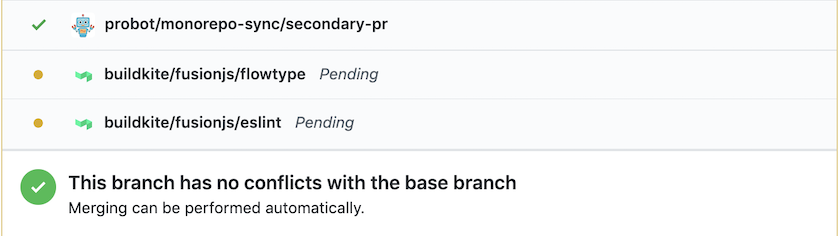

# Contributing to fusionjs

**Before continuing, make sure you've read the Rush [Getting Started as a Developer](https://rushjs.io/pages/developer/new_developer/) guide**.

This repo is maintained using [rushjs](https://rushjs.io). This doc will detail the commands needed to perform various tasks, but it's also helpful to read through the Rush [command docs](https://rushjs.io/pages/commands/rush_add/) as well.

---

### Table of contents

- [Design decisions](#design-decisions)
- [Authoring changes](#authoring-changes)
- [Dependencies](#dependencies)
  - [Install](#install)
  - [Add new](#add-new)
  - [Upgrade](#upgrade)
  - [node_modules/yarn.lock](#node_modulesyarnlock)
- [Workflow](#workflow)
- [Releasing changes](#releasing-changes)
  - [Canary releases](#canary-releases)
  - [Releases](#releases)

---


## Design decisions
<sup><a href="#table-of-contents">Back to top</a></sup>

#### Problem

How can we keep our open source codebase independent for external contributors, but still part of our larger, private codebase so we can easily develop, test, and release changes throughout the entire codebase without worrying about anything being out of sync?

#### Solution

A private "parent" monorepo ([uber/fusionjs](https://github.com/uber/fusionjs)) and a public "child" subset monorepo ([fusionjs/fusionjs](https://github.com/fusionjs/fusionjs)) that is able to operate independently. To achieve this, we use [a probot app](https://github.com/uber-workflow/probot-app-monorepo-sync) to keep the two in sync whenever a change is pushed to them

## Authoring changes
<sup><a href="#table-of-contents">Back to top</a></sup>

#### Private *and* public monorepo? Where do I make my changes?

If you have access to the private monorepo, it's fine to make both private and public changes there. If you author a PR in the private repo that changes files in the `public` directory, the sync bot will automatically open a PR for it in the public repo (referencing [the metadata](.github/pull_request_template.md) in your PR body).

Alternatively, all PRs opened in the public repo will have a corresponding PR opened for them in the private repo. There's no metadata involved in that scenario, as the public PR is then used as the source of truth (i.e. private PR will just directly mirror the title/body of the public PR).

The only thing to consider here is visibility to the external/open source community. If you have a conversation in a private PR about a change that impacts the public repo, that could be valuable information missing to external developers. In general, just try to keep the open source visibility in mind when making changes.

#### Where does CI run?

The public and private repos actually have their own CI. This is partially the reason why there's such a tight coupling with PRs between the two repos. All changes made in either repo are tested against the entire fusion codebase. This is the key to being able to have a split codebase; we can now catch regressions or test failures for all changes *as they're happening* instead of after the fact.

<p>
  
</p>

##### Additional status check

If your PR has a partner PR in the other repo, you'll also notice an extra status check indicating the status of its CI (see image).

#### How do I merge with two separate PRs for one change?

Assuming all CI is successful, go ahead and merge like you normally would; the sync bot will take care of merging the other PR.

#### What if I want to close my PR without merging?

Just close it. The bot will close the other PR for you (and will likewise re-open it if you re-open yours)


## Dependencies
<sup><a href="#table-of-contents">Back to top</a></sup>

**NOTE**: Rush uses its own binary for yarn (version specified in `rush.json` > `yarnVersion`), so the only version you should need to worry about is node (configured in `rush.json` > `nodeSupportedVersionRange`)

#### Install

Equivalent: `yarn install`

See: [rush install](https://rushjs.io/pages/commands/rush_install/), [rush build](https://rushjs.io/pages/commands/rush_build/)

```sh
rush install && rush build
```

#### Add new

Equivalent: `yarn add lodash`

Currently, using `rush add` is broken with the following error:

    ERROR: The Yarn package manager is not currently supported by the "rush add" command.

To work around this, manually update the dependency in the projects `package.json`. Then run `rush update --full --purge`. This may take some time.

#### Upgrade

Equivalent: `yarn upgrade`

See: [rush update](https://rushjs.io/pages/commands/rush_update/)

```sh
rush update
```

#### node_modules/yarn.lock

Instead of `yarn.lock` being in the repository root or in individual packages, there now is a single, Rush-managed lockfile at `common/config/rush/yarn.lock`; and similarly, `common/temp/node_modules` is where all dependencies are installed and symlinked from in each package.


## Workflow
<sup><a href="#table-of-contents">Back to top</a></sup>

For linting, testing, and type checking individual packages, there isn't much of a difference. Each package still has its own `flow`, `lint` and `test` scripts, so running `yarn test`, for example, still works as expected.


## Releasing changes
<sup><a href="#table-of-contents">Back to top</a></sup>

#### Canary releases

1. Click commit status icon (checkmark on commit list view)
2. Click "Details" on check run named "Release"
3. Click ":baby_chick: Canary release" button on check run details page

This will create a GitHub Deployment, which in turn triggers a https://buildkite.com/uber/fusionjs-publish job, which publishes a canary version for all packages. If the monorepo git hash is abc123, each package will have version 0.0.0-canary.abc123.0.

#### Releases

1. On master branch, click "Details" on commit check run named "Release"
2. Click ":rocket: Release PR" button on check run details page
  a. Note: The "Package tarball hashes" status must be set
3. Open automatically created release PR
4. Edit .release.toml with new versions for changed/new packages
5. Edit .release-notes.md
6. Merge PR after review + approval

